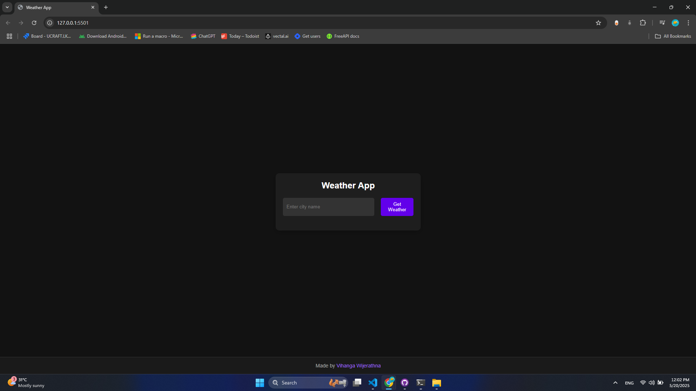

# Weather App

A simple, responsive weather application built with vanilla JavaScript that allows users to check the current weather conditions of any city around the world.



## Features

- Search for weather information by city name
- Display current temperature in Celsius
- Show weather description
- Responsive design that works on desktop and mobile devices
- Clean, modern UI with dark mode interface

## Technologies Used

- HTML5
- CSS3 (with media queries for responsiveness)
- Vanilla JavaScript (ES6+)
- OpenWeatherMap API for weather data
- Async/await for API requests

## How to Use

1. Clone this repository
2. Open `index.html` in your browser
3. Enter a city name in the search field
4. Click "Get Weather" to see the current weather conditions

## API Key

This project uses the OpenWeatherMap API. The API key is included in the code for demonstration purposes, but in a production environment, you should:

- Create your own API key at [OpenWeatherMap](https://openweathermap.org/api)
- Store the API key in environment variables
- Add your API key configuration to `.gitignore`

## Live Demo

You can try the live demo here: [Demo Link](https://vihangawijerathna.github.io/weather-app-js/)

## Setup for Development

```bash
# Clone the repository
git clone https://github.com/vihangawijerathna/weather-app-js.git

# Navigate to the project directory
cd weather-app-js

# Open in your browser
# You can use a local server like Live Server extension in VSCode
```

## Future Improvements

- Add forecast for upcoming days
- Add geolocation to automatically detect user's city
- Add units toggle (Celsius/Fahrenheit)
- Add weather icons
- Implement local storage to save the last searched city

## License

MIT License - feel free to use and modify this project for your own purposes.

## Author

[Vihanga Wijerathna](https://github.com/vihangawijerathna)
